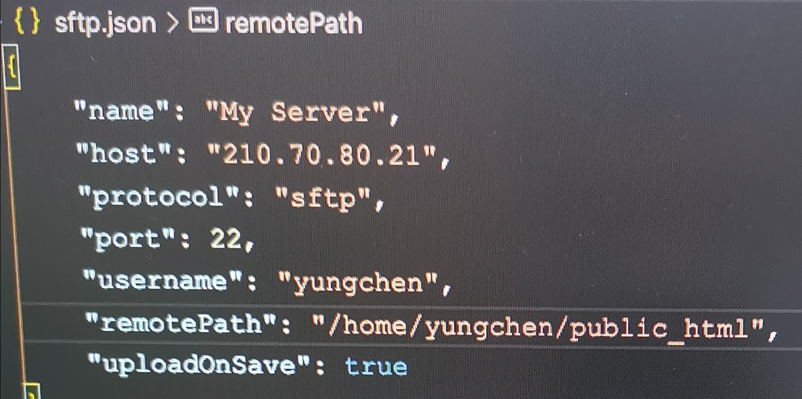

# 109021058_YenHsunKuo_20210319

## <b>操作流程
1. 點選左下齒輪
2. 點選Command Palette...
3. 上方輸入sftp(需先載該套件)
4. 
5. 開html檔 儲存後輸入密碼
6. http://210.70.80.21/~bs109021058 (帳號)
 
PS.如非用學校網路需用VPN(學校主頁網站右側網路資源中下載)
 
使用VPN速度會較慢 可在jason內新增設定 "connectTimeout": 30000,(單位為毫秒 1000毫秒 = 1秒)
 
VPN資源: https://ic.asia.edu.tw/files/13-1057-80657.php?Lang=zh-tw
 
7. 終端機(檢查是否有檔案):
- ssh bs109021058@210.70.80.21
- (密碼)
- ll
- cd public_html
- ll
 
 
 

## <b>HTML語法
- 置中: style = "text-align: center;"
- 選色: style = "background-color: rgb(253, 255, 218)"
- 漸層選色: style = "background-image:liner-gradient"
- 換色: 
- 表格外框: <style = "border: 5px solid #0000ff;">
- 表格寫法:
 tr(橫行)
 th(直列)
 /th
 /tr
- ccs設定全套用:
 
table{
     border: 1px solid #0000ff;
     border_collapse: collapse;
     width: 600px;
     text-align: center;
     margin: 2em auto 1em auto ;(上右下左)    
}

